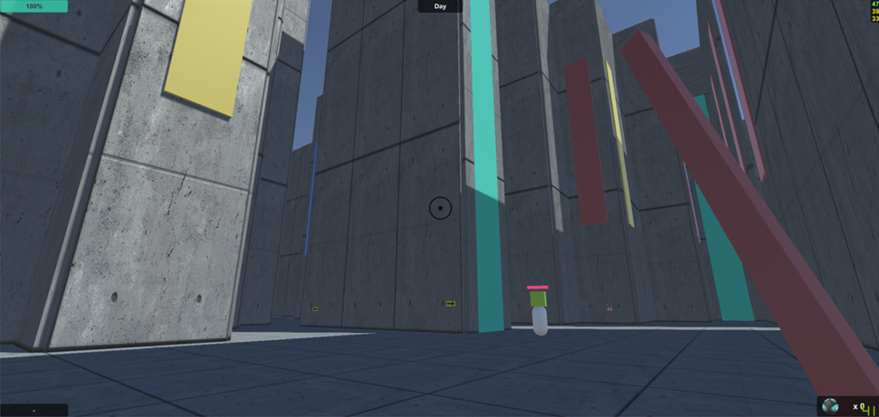

# The Maze
Escape The Maze!

## Summary
This first person escape game was heavily inspired by the movie *The Maze Runner* , itself adapted from *The Maze Runner* book series.

* Procedurally generated "perfect" maze
    * augmented wih doors and discoverable rooms
    * 4 parts with different caracteristics
    * more than 100.000m² of surface
* Short and long range weapons against intelligent enemies
* Interactable objects like food, locks and tags

More screenshots can be found in the [screenshots](screenshots/) folder.

## Installation & Start-up
* Download and install `Unity Editor 5.4.3f1` from the [Unity download archive](https://unity3d.com/get-unity/download/archive)
* Open the `TheMaze` sub-folder with `Unity Editor 5.4.3f1`
* In the `Project` window
    * Click on `Assets` -> `Scenes`
    * Double click on the `MenuScene`
* In the `Game` window, make sure `Maximize on Play` is selected
* Click on the `Play` button.

## Credits
Tanguy SOTO

Nicolas BILLOD

2017
